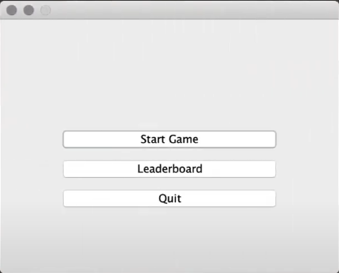
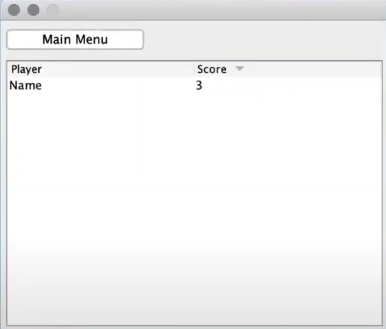
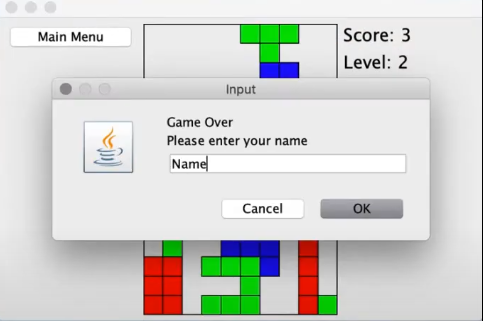
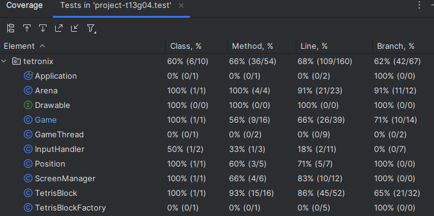

## Tetronix

Este projeto é inspirado no jogo Tetris. O objetivo do jogo é completar linhas movendo peças de diferentes formas que descem no campo de jogo. Linhas completas desaparecem e concedem pontos ao jogador, enquanto o jogo termina quando as linhas incompletas alcançam o topo do campo. Quanto mais tempo o jogador adiar esse desfecho, maior será sua pontuação.

As funcionalidades previstas para implementação incluem:

->Movimento contínuo de descida dos blocos.

->Interação do jogador com os blocos, permitindo movê-los lateralmente e rotacioná-los.

->Detecção de colisões entre os blocos em movimento e os já posicionados no campo.

->Limpeza de linhas completas.

->Adição de mais formas para os blocos.

->Menu inicial do jogo.

->Exibição da pontuação atual ao jogador.

->Implementação de um leaderboard, armazenando as classificações finais de diferentes partidas.

## Desenvolvimento

1.Modelo:

->Arena:Representa o background do jogo.
        Fornece métodos para fixar blocos que colidiram de forma vertical no background.

->TetrisBlock: Representa o bloco em movimento, tendo algumas informações como a cor, a posição atual e as possiveis rotações. Apresenta ainda alguns métodos relacionados com a movimentação do bloco,a verificação de colisões e limites.
		
->Position: Contém a informação sobre a posição do bloco no background.
		
->TetrisBlockFactory: Cria blocos de diferentes formas e cores.

->GameThread: Controla a queda contínua do bloco.

2.Vista:

->ScreenManager: Gerencia a tela (terminal) e abstrai as operações de desenho. Permite desenhar os blocos e a arena utilizando as classes TextGraphics e Screen da Lanterna.

->TetrisBlock e Arena como Drawable: Ambas as classes implementam a interface Drawable, que contém o método draw(TextGraphics graphics). Estas são responsáveis por desenhar o bloco e o background, respetivamente.

3.Conexão entre Modelo e Vista:

->Game: Recorre a métodos como "handleInput" para processar as entradas do jogador e atualizar o estado do jogo.

## Documentação

1.MVC:
   
->O projeto segue uma aproximação ao padrão MVC, com separação parcial entre o modelo (lógica do jogo), a vista (interface gráfica) e o controlador (controle de fluxo e interações).

2.Factory Method:
       
->A classe TetrisBlockFactory constrói os blocos, separando assim esta funcionalidade da classe Game, que apenas se dedica à utilização dos mesmos.

3.Command Pattern:
   
->O método draw da interface Drawable é implementado pelas classes TetrisBlock e Arena, permitindo que ambas sejam tratadas como "desenháveis". A utilização deste design pattern simplifica a lógica de renderização usada na classe Game.

4.Observer pattern:

->A classe Game age como um observador, invocando métodos em outras classes para atualizar o estado do jogo.

## Testes

De momento estão presentes 24 testes distribuídos pelas 3 classes principas: "GameTest", "ArenaTest","TetrisBlockTest".
Segue-se o resultado dos testes com coverage:

## Processo

De momento, exitem 5 branchs no github, procede-se a explicação das mesmas considerando a sua ordem cronológica:

->master: Introdução ao projeto, com a exibição de um bloco de Tetris na tela.

->MoveBlockDown: Criação de uma thread que move o bloco continuamente para baixo e que o interrompe ao atingir a base do campo de jogo.

->InteractWithBlock: Implementação da interação do jogador com os blocos, permitindo-o rotacioná-los, movê-los lateralmente e enviá-los diretamente para a base do campo.

->Tests: Criação inicial de testes para validar as funcionalidades já implementadas.

->coliding_blocks: Implementação da colisão vertical entre os blocos. De seguida, a estrutura do projeto foi ajustada para seguir alguns design patterns. Por fim, novos testes foram adicionados com base nas alterações realizadas. Esta branch será usada para continuar o projeto, com a implementação da colisão lateral entre os blocos.

Nas próximas branches, novas funcionalidades serão implementadas juntamente com os testes que as validam.

