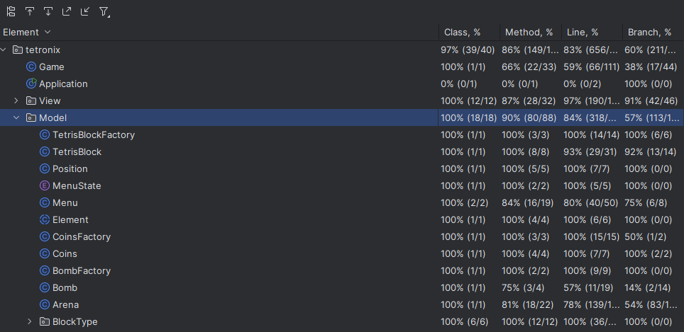

# LDTS_T06_G01 - TETRONIX

## Game Description

Tetronix é um jogo inspirado no clássico Tetris. O objetivo é mover peças de diferentes formas que descem no campo de jogo para completar linhas. Linhas completas desaparecem e dão pontos ao jogador, enquanto o jogo termina quando as linhas incompletas alcançam o topo da arena. Quanto mais tempo o jogador evitar esse desfecho, maior será a sua pontuação. O jogo conta com moedas que ao serem capturadas aumentam a pontuação do jogador e bombas que devem ser evitadas pois eliminam o bloco quando há contacto entre os mesmos. Quanto mais linhas o jogador completa, mais rápido se torna o jogo.

Este projeto foi desenvolvido por Artur Moreira (up202208189@edu.fe.up.pt), Daunísia Jone (up202109246@edu.fe.up.pt) e Flávio Magalhães (up202309694@edu.fe.up.pt) para LDTS 2024-25.

## Implemented Features

- **Movimento contínuo dos blocos** - Os blocos descem automaticamente ao longo do tempo.
- **Interação com blocos** - O jogador pode mover os blocos lateralmente (setas esquerda e direita), rotacioná-los (seta para cima) e movê-los para baixo (seta para baixo.
- **Deteção de colisões** - Colisões entre os blocos e as bombas, as moedas, assim como as bordas da arena são verificadas.
- **Limpeza de linhas completas** - Linhas completas desaparecem, acrescentando pontos ao jogador.
- **Menu inicial** - Inclui as opções para iniciar o jogo e sair do jogo.
- **Menu de Game Over** - Inclui as opções para iniciar um novo jogo e visualizar as estatísticas e sair do jogo.
- **Pontuação** - A pontuação atual do jogador é visível durante o jogo.
- **Nível** - O nível atual do jogador é visível durante o jogo e o mesmo aumenta a cada linha completa.
- **Statistics** - Armazena e exibe as classificações finais de diferentes jogos.

## Planned Features

Todas as funcionalidades planeadas foram implementadas com sucesso.

## DESIGN

---

### OS ESTADOS DO JOGO DEVERIAM SER GERIDOS DE FORMA INDEPENDENTE

**Problema no Contexto**

Anteriormente, a lógica de controle dos estados do jogo (como `PLAYING`, `GAME_OVER`, `STATISTICS`) era implementada com verificações condicionais espalhadas em vários métodos. Isso gerava um código difícil de manter, com baixo nível de modularidade, violando o **Princípio da Responsabilidade Única (SRP)**. Era necessário uma solução que organizasse o comportamento de cada estado e facilitasse transições claras entre eles.

**O Padrão**

Foi aplicado o padrão **State**, que permite encapsular os comportamentos específicos de cada estado em classes separadas. Esse padrão resolve o problema organizando as transições de estado e permitindo que o comportamento do sistema mude dinamicamente, dependendo do estado atual.

**Implementação**

Na implementação:
- O padrão foi mapeado para a classe `Menu`, que atua como o contexto gerenciando o estado atual do menu.
- Cada estado foi representado como uma classe que herda de `MenuState`, encapsulando comportamentos específicos como `PlayingState` e `GameOverState`.
- A transição entre estados ocorre dinamicamente com base nas ações do jogador ou no fluxo do jogo.

**UML State Pattern**  ######################

Os arquivos relevantes são:
- [`Menu`](../src/main/java/tetronix/Model/Menu.java)
- [`MenuState`](../src/main/java/tetronix/Model/MenuState.java)
- [`PlayingState`](../src/main/java/tetronix/Model/PlayingState.java)
- [`GameOverState`](../src/main/java/tetronix/Model/GameOverState.java)

**Consequências**

A aplicação do padrão **State** trouxe os seguintes benefícios:
- Cada estado é explicitamente representado no código, eliminando a complexidade de verificações condicionais.
- O código é modular e segue o **Princípio da Responsabilidade Única (SRP)**, separando claramente os comportamentos de cada estado.
- Facilita a adição de novos estados e transições sem impactar significativamente o código existente.

---

### A CRIAÇÃO DE BLOCOS TETRIS DEVERIA SER CENTRALIZADA

**Problema no Contexto**

A criação de blocos Tetris era realizada diretamente na classe principal do jogo, o que resultava em lógica redundante e dificuldade em adicionar novas formas ou comportamentos. Isso violava o **Princípio Aberto/Fechado (OCP)**, pois qualquer mudança na forma dos blocos exigiria alterações no código base.

**O Padrão**

Foi aplicado o padrão **Factory Method**, que delega a responsabilidade de criação de objetos para uma classe específica, neste caso, a `TetrisBlockFactory`. Esse padrão organiza a lógica de criação e facilita a expansão para incluir novos tipos de blocos.

**Implementação**

Na implementação:
- `TetrisBlockFactory` é a fábrica responsável por criar blocos Tetris. Cada bloco é inicializado com uma forma, cor e rotações predefinidas.
- `TetrisBlock` contém os dados do bloco (como a posição e a forma atual) e as possíveis rotações.

**UML Factory Method** #################

Os ficheiros relevantes são:
- [`TetrisBlock`](../src/main/java/tetronix/Model/TetrisBlock.java)
- [`TetrisBlockFactory`](../src/main/java/tetronix/Model/TetrisBlockFactory.java)

**Consequências**

A aplicação do padrão **Factory Method** trouxe os seguintes benefícios:
- A lógica de criação dos blocos foi centralizada, seguindo o **Princípio da Responsabilidade Única (SRP)**.
- Novos tipos de blocos podem ser adicionados sem alterar a lógica existente, respeitando o **Princípio Aberto/Fechado (OCP)**.
- Reduz redundâncias, tornando o código mais limpo e fácil de manter.

---

### A INTERFACE DO JOGO DEVERIA GERIR DIVERSOS ELEMENTOS

**Problema no Contexto**

O jogo requer a exibição de múltiplos elementos na interface, como blocos, bombas, moedas e o campo de jogo (arena). Inicialmente, a lógica de renderização desses elementos era espalhada por várias classes, tornando o código redundante e difícil de estender.

**O Padrão**

Foi aplicado o padrão **Composite**. Esse padrão permite tratar objetos individuais e composições de objetos de forma uniforme, simplificando a lógica de renderização. Uma interface comum (`ElementViewer`) foi criada para abstrair o comportamento dos elementos visuais.

**Implementação**

Na implementação:
- `ElementViewer` é a interface que define o método `draw`, compartilhado por todas as classes que representam elementos visuais (e.g., `BombView`, `ArenaView`).
- Cada classe concreta implementa `ElementViewer` e fornece a lógica específica para desenhar seu respectivo elemento.

**UML Composite Pattern** ################

Os ficheiros relevantes são:
- [`ElementViewer`](../src/main/java/tetronix/View/ElementViewer.java)
- [`ArenaView`](../src/main/java/tetronix/View/ArenaView.java)
- [`BombView`](../src/main/java/tetronix/View/BombView.java)
- [`CoinView`](../src/main/java/tetronix/View/CoinView.java)

**Consequências**

A aplicação do padrão **Composite** trouxe os seguintes benefícios:
- Permite tratar todos os elementos visuais de forma uniforme, simplificando a lógica de renderização.
- Facilita a adição de novos elementos visuais, pois basta implementar a interface `ElementViewer`.
- Reduz redundâncias e melhora a organização do código relacionado à interface gráfica.

---

### A TRANSIÇÃO DE ESTADOS DEVERIA NOTIFICAR O SISTEMA

**Problema no Contexto**

No jogo, mudanças de estado (como alternar entre `PLAYING`, `GAME_OVER` ou `STATISTICS`) precisavam refletir em outras partes do sistema, como as visualizações (views) e controladores (controllers). Inicialmente, não existia um mecanismo explícito para notificar diferentes componentes sobre estas transições, resultando num acoplamento excessivo entre a lógica de controlo e a interface. Isto dificultava a extensão ou manutenção do código.

**O Padrão**

O padrão **Observer** foi aplicado implicitamente, onde o método `setState` da classe `Menu` atua como o ponto de transição de estados. O padrão Observer permite que os objetos interessados (observers) sejam notificados automaticamente quando o estado de outro objeto (o subject) muda. Esta implementação reduz o acoplamento e promove a modularidade.

**Implementação**

Na implementação:
- A classe `Menu` funciona como o **subject**, contendo o método `setState`. Quando o estado é alterado, componentes como o controlador (`InputHandler`) e as views reagem a esta mudança.
- As classes interessadas (como views e controladores) agem como **observers**, reagindo ao novo estado e atualizando os seus comportamentos.

Exemplo:
- Quando o estado muda para `GAME_OVER`, o controlador ajusta as interações do jogador e a view exibe o ecrã correspondente.

**UML Observer Pattern** ##################

Os ficheiros relevantes são:
- [`Menu`](../src/main/java/tetronix/Model/Menu.java)
- [`InputHandler`](../src/main/java/tetronix/Control/InputHandler.java)
- [`MenuView`](../src/main/java/tetronix/View/MenuView.java)

**Consequências**

A aplicação do padrão **Observer** trouxe os seguintes benefícios:
- **Redução de acoplamento**: A lógica de notificação está centralizada no método `setState`, enquanto os observers estão desacoplados.
- **Atualização automática**: As mudanças de estado refletem automaticamente nos componentes relevantes, melhorando a consistência do sistema.

## Known-code smells
Não foram identificados problemas significativos no código. O projeto segue boas práticas de desenvolvimento.

## Testing

### Screenshots do coverage report

## Self-evaluation

O trabalho foi dividido de forma equitativa e todos os membros contribuíram, enriquecendo conhecimentos em Java e padrões de design, além de aprimorar os skills de trabalho em equipe.

- Artur Moreira: 33.3%
- Daunísia Jone: 33.3%
- Flávio Magalhães: 33.3%

